# WireGuard Secure Remote Access Gateway

WireGuard | Raspberry Pi | SSH | iptables

## Overview

The goal of this project was to build a secure, self-hosted remote access solution that would let me reach my home network from anywhere without exposing services directly to the internet. I chose WireGuard for its simplicity, speed, and modern cryptographic design, running on a Raspberry Pi as a lightweight always-on gateway.

## What I Built

### 1. WireGuard Tunnel Setup

Generated key pairs for the server and each client, configured the WireGuard interface on the Pi, and set up peer configurations with restricted `AllowedIPs` so each client can only reach what it needs. The tunnel uses UDP on a non-standard port to reduce noise from automated scanners.

### 2. System Hardening

Locked down SSH with key-based authentication only, disabled root login and password auth. Configured `iptables` rules to drop everything except WireGuard and SSH traffic, with logging enabled for denied packets.

### 3. Firewall & Routing

Enabled IP forwarding and configured NAT masquerading so tunnel traffic can reach the LAN. Set up split-tunnel routing on the client side so only home network traffic goes through the VPN, keeping general browsing on the local connection for performance.

## How It Was Built

### Initial Setup

Using Raspberry Pi Imager, I installed Ubuntu Server 25.10 with SSH enabled and an `id_ed25519` handshake from System 1 with password authentication disabled.

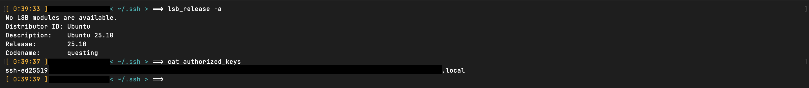

In order to properly engage SSH on the raspi through the USB-Ethernet adapter, I had to change a number of network settings on System 1. The adapter automatically created its own IP, and using DHCP, the default interface (`eth0`) on the raspi assigned its own IP on the subnet of the adapter.

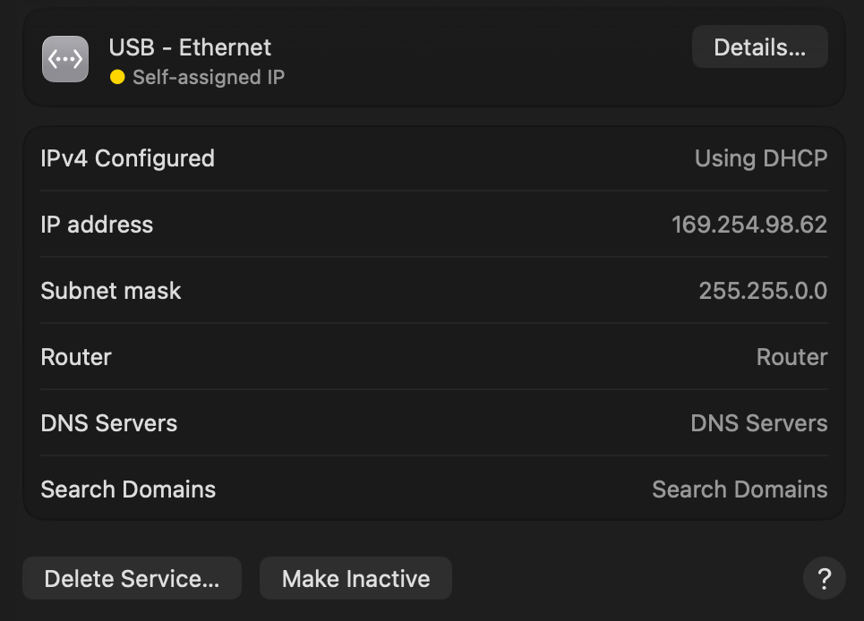

Due to the extremes of this IP, I decided to change the IP to the subnet of the local IP address, which was: `192.168.2.1`. The DHCP of the raspi automatically changed its local IP to: `192.168.2.6`. As shown by the following output of `arp-scan`. Also I changed the DNS to `8.8.8.8` to allow the raspi to route to outside connections.

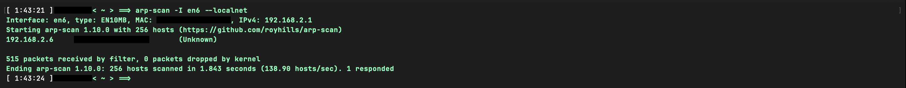

### Installing and Implementing WireGuard

WireGuard was installed on System 1 using `brew install wireguard` and on the raspi using `sudo apt install wireguard`. After WireGuard is installed on both systems, it is time to create WireGuard configurations.

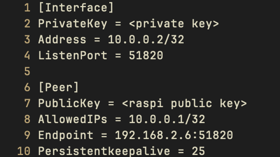

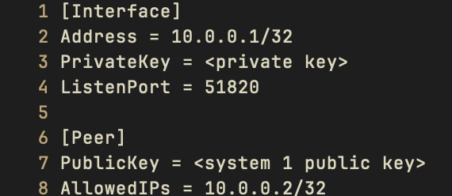

Both WireGuard configurations were named `wg0.conf` to ease any confusions regarding interfaces configurations. Thus with the command `sudo wg-quick up wg0`, after moving each config to its respective `wireguard` folder, the gateway is now open.

System 1 `sudo wg show`

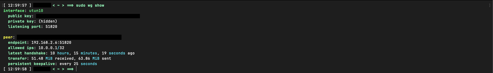

Raspberry Pi `sudo wg show`

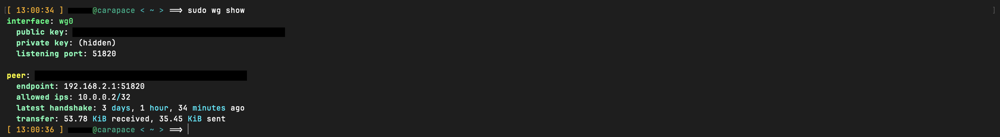

Confirmation to show that the handshake is working. WireGuard should show that there is a transfer sent to both sides.

### System Hardening

With the tunnel working, the next step was locking down the raspi so it isn't exposed to unnecessary risk. The first target was SSH. I edited `/etc/ssh/sshd_config` to disable password authentication entirely and block root login, leaving key-based auth as the only way in.

After restarting the SSH daemon with `sudo systemctl restart sshd`, I verified that password login attempts were rejected and only the `id_ed25519` key from System 1 was accepted.

Next I set up `iptables` rules on the raspi to drop all inbound traffic except WireGuard (UDP port 51820) and SSH. Everything else gets dropped by default, and denied packets are logged so I can review them later.

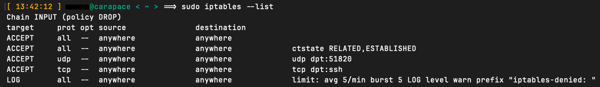

To make the rules persist across reboots, I saved them with `sudo iptables-save > /etc/iptables/rules.v4` and installed the `iptables-persistent` package.

### Firewall & Routing

With the tunnel up and the raspi locked down, the last piece was making sure traffic could actually flow from WireGuard clients through to the home LAN. By default, Linux does not forward packets between interfaces, so the first step was enabling IP forwarding by adding `net.ipv4.ip_forward=1` in `/etc/sysctl.conf` and applying it with `sudo sysctl -p`.

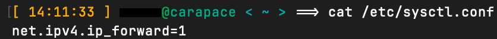

Next I added `iptables` rules to the FORWARD chain to allow traffic originating from the WireGuard interface (`wg0`) to pass through to the LAN, and to allow return traffic for established connections back into the tunnel. Without these, packets would arrive at the raspi and get dropped even though the INPUT chain was fine.

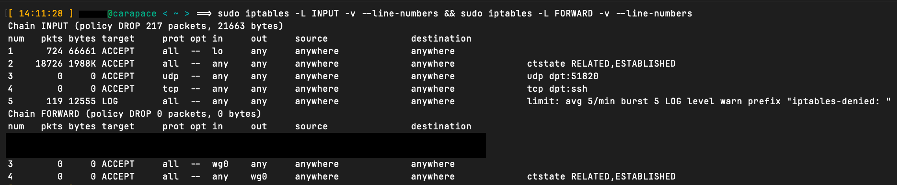

For the LAN to actually respond to tunnel clients, I set up NAT masquerading on the outbound interface with `iptables -t nat -A POSTROUTING -o eth0 -j MASQUERADE`. This rewrites the source address of tunnel traffic to the raspi's LAN IP, so other devices on the network see the requests as coming from the raspi itself and know where to send replies. Without masquerading, responses would be addressed to the `10.0.0.0/24` subnet, which the LAN has no route to.

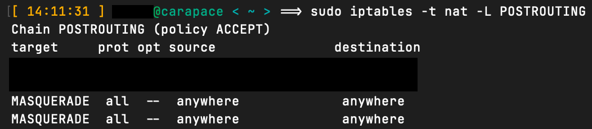

On the client side, I configured split-tunnel routing so that only traffic destined for the home network (`192.168.2.0/24`) gets routed through the VPN. This was done by setting `AllowedIPs = 192.168.2.0/24, 10.0.0.0/24` in System 1's `wg0.conf` rather than using `0.0.0.0/0`, which would route all traffic through the tunnel. The result is that browsing and general internet traffic stays on the local connection for speed, while home network access goes through WireGuard.

After confirming that System 1 could reach devices on the home LAN through the tunnel, I saved the full ruleset again with `sudo iptables-save > /etc/iptables/rules.v4` to make sure the forwarding and NAT rules persisted alongside the hardening rules from earlier.

## Conclusion

This project gave me a working, self-hosted VPN that I can rely on to securely access my home network from anywhere.

Beyond just getting remote access working, the process taught me a lot about how Linux networking actually operates under the hood. Configuring IP forwarding, writing iptables rules across multiple chains, and debugging NAT masquerading forced me to understand packet flow.

If I revisit this project, I would like to add automatic key rotation, set up monitoring to track tunnel uptime and throughput, and explore adding a second raspi as a failover node. For now, though, the setup is solid and does exactly what I need.

## Tools Used

WireGuard, Raspberry Pi OS, iptables, SSH, Bash scripting, systemd
